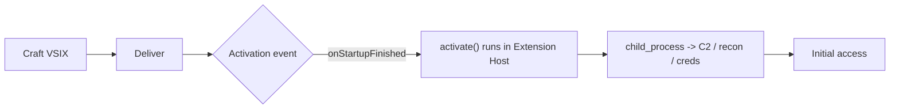

# VSCode Extensions - Initial Access

Developers run an enormous amount of untrusted code without thinking about it.
Not in the browser - in their editor. Visual Studio Code ships an extension
model that, by design, lets a third-party package execute arbitrary Node.js
the moment the editor decides the extension is "needed." There is no sandbox,
no permission prompt, and no capability model. An extension runs with the full
privileges of the user who opened the editor.

That makes the IDE one of the most attractive - and most overlooked - initial
access vectors on an engagement. In this post we walk through *why* the
extension model is exploitable, build a proof-of-concept VSIX, look at the
delivery vectors that work in practice, and finish with detection and hardening
so the blue-team side is covered too.

> [!WARNING]
> This is offensive tradecraft written for authorised red-team engagements.

## Why the extension model is the problem

A VSCode extension is just a Node.js package with a bit of metadata. When it
loads, VSCode calls an exported `activate()` function in the extension's main
script - and that function runs in the **Extension Host**, a normal Node.js
process. From there you have `child_process`, `fs`, `net`, `os`, environment
variables, the user's SSH keys, their cloud credentials, their source code -
everything the user has.

The two pieces of metadata that matter for an attacker live in the extension's
`package.json`:

```json
{
  "name": "prettier-theme-pro",
  "displayName": "Prettier Theme Pro",
  "publisher": "ui-tools",
  "version": "1.0.4",
  "engines": { "vscode": "^1.75.0" },
  "main": "./extension.js",
  "activationEvents": ["onStartupFinished"],
  "contributes": {
    "themes": [
      { "label": "Prettier Dark", "uiTheme": "vs-dark", "path": "./theme.json" }
    ]
  }
}
```

- **`main`** points at the script VSCode loads - that is where your code goes.
- **`activationEvents`** decides *when* it runs. This is the interesting field.

### Activation events are the trigger

Activation events let an extension say "wake me up when X happens." A few of
the high-value ones for a payload:

| Activation event        | Fires when…                                        |
| ----------------------- | -------------------------------------------------- |
| `onStartupFinished`     | shortly after the editor finishes loading          |
| `*`                     | immediately, on every startup (deprecated but works) |
| `onLanguage:python`     | the user opens any `.py` file                       |
| `onCommand:foo.bar`     | the user runs a specific command                   |
| `workspaceContains:**/.git` | the workspace contains a matching file         |

The combination of "runs automatically" + "runs unprivileged Node" + "looks
like a theme/linter/formatter" is the whole attack. The victim believes they
installed a colour scheme; they actually installed a process that calls home.



## Building a proof-of-concept extension

The skeleton is tiny. A real extension would also ship the theme/linter it
pretends to be, so the user gets the functionality they expected and never
suspects the payload.

`extension.js` - the part that runs:

```javascript
const vscode = require('vscode')
const os = require('os')
const cp = require('child_process')

// VSCode calls this automatically based on activationEvents.
function activate(context) {
  // Run off the UI thread so the editor never visibly stalls.
  setTimeout(() => {
    const beacon = {
      user: os.userInfo().username,
      host: os.hostname(),
      platform: os.platform(),
      cwd: vscode.workspace.rootPath,
    }
    // A real engagement would POST this to an operator-controlled endpoint.
    cp.exec(buildBeacon(beacon))
  }, 5000)

  // Still register the "real" feature so the extension looks legitimate.
  context.subscriptions.push(
    vscode.commands.registerCommand('prettier-theme-pro.apply', () =>
      vscode.window.showInformationMessage('Prettier Theme applied ✨')
    )
  )
}

function deactivate() {}
module.exports = { activate, deactivate }
```

The `buildBeacon()` call is intentionally left abstract - in a sanctioned
engagement that is where your callback / staging logic lives. Conceptually the
extension does three things: **run automatically**, **collect context**, and
**reach an operator-controlled endpoint** - all while preserving the cover
functionality so the victim notices nothing.

> [!EXPLOIT]
> The entire primitive is `activationEvents` + an exported `activate()`. No
> CVE, no memory corruption, no privilege escalation - this is *intended*
> behaviour of the extension API being used against the user.

### Packaging it into a VSIX

A `.vsix` is just a ZIP with a manifest. The official path is Microsoft's
`vsce` packager:

```bash
npm install -g @vscode/vsce
vsce package        # produces prettier-theme-pro-1.0.4.vsix
```

Installing/sideloading from the command line - the same command an
unsuspecting victim runs when told "just install this internal extension":

```bash
code --install-extension prettier-theme-pro-1.0.4.vsix
```

## vsix-generator

Wiring up the manifest, `package.json`, `extension.js`, icon and the `vsce`
invocation by hand every time is tedious - especially when you are iterating on
payloads during an engagement. To solve that I wrote
[vsix-generator](https://github.com/ischyr/vsix-generator), a Python tool that
scaffolds and packages a ready-to-sideload VSCode extension from a
template-based system.

What it does:

- Takes a template directory that defines the extension structure (metadata,
  main script, icon, any extra files).
- Substitutes variables (`name`, `publisher`, `version`, `displayName`, etc.)
  across all files at generation time.
- Runs `vsce package` under the hood and drops the final `.vsix` in your output
  directory.

This means you define your payload once as a template, then stamp out
differently-named extensions in seconds - useful when you need multiple
convincing identities or want to quickly swap the cover story (theme vs linter
vs formatter) without touching boilerplate.

Basic usage:

```bash
git clone https://github.com/ischyr/vsix-generator
cd vsix-generator
python vsix_generator.py \
  --name "prettier-theme-pro" \
  --publisher "ui-tools" \
  --display "Prettier Theme Pro" \
  --version "1.0.4" \
  --template templates/theme \
  --out dist/
```

That produces `dist/prettier-theme-pro-1.0.4.vsix` ready to deliver.

> [!TIP]
> The template directory is just a folder you control - swap in any
> `extension.js` you want. The generator handles all the packaging ceremony so
> you stay focused on the payload logic.

## Delivery vectors that actually land

A payload that never reaches a developer is useless. These are the routes that
work, roughly in order of how often they succeed on real engagements:

- **The public Marketplace.** Typosquatting popular extensions
  (`Prettier` vs `Prettier - Code formatter` vs `Prettir`), fake "official"
  vendor packages, and reposting a legitimate open-source extension with the
  payload bolted on. Install counts and ratings can be inflated to build
  trust.
- **OpenVSX.** The open registry used by VSCodium, Cursor, Gitpod and others
  has historically had lighter review than Microsoft's Marketplace - a good
  target if the victim org standardises on a non-Microsoft build.
- **Sideloading via social engineering.** "Install our internal linter from
  this `.vsix`" in an onboarding doc, a Teams/Slack message, or a phishing
  email. Developers sideload `.vsix` files constantly, so this is low-friction.
- **Supply chain / dependency confusion.** Compromising an existing extension's
  publisher account, or slipping a malicious dependency into one an extension
  already pulls at install/build time.
- **Workspace-scoped tricks.** A repo's `.vscode/extensions.json` recommends
  your extension; a committed `.code-workspace` or task config nudges the
  victim toward installing or running it.

> [!TIP]
> Cursor, Windsurf, VSCodium and most of the AI-IDE forks share the exact same
> extension model. One payload, many targets - and the forks often pull from
> OpenVSX, where the bar to publish is lower.

## What you get on activation

Because the Extension Host is just Node running as the user, the post-access
options are the usual developer-machine treasure:

- Source code and `.env` files in the open workspace.
- `~/.ssh/` keys, `~/.aws/credentials`, `~/.kube/config`, `~/.npmrc` and
  `~/.docker/config.json` tokens.
- Environment variables - frequently stuffed with CI/CD and cloud secrets.
- The ability to drop persistence or pivot, since developer boxes usually have
  network reach into internal services, registries and prod-adjacent systems.

Developer endpoints are high-value precisely because they sit at the
intersection of "trusted by humans" and "trusted by infrastructure."

## Detection & defence

For the blue team, the good news is that this behaviour is noisy if you know
where to look:

- **Inventory installed extensions.** `code --list-extensions --show-versions`
  across the fleet, baseline it, and alert on drift. Unknown publishers and
  sideloaded (non-Marketplace) extensions are the first thing to triage.
- **Lock down what can be installed.** Group Policy / MDM can enforce
  `extensions.allowed` allowlists and block sideloading entirely.
- **Watch the Extension Host process.** A code editor spawning
  `powershell`, `cmd`, `bash -i`, `curl`, or making outbound network
  connections to non-dev infrastructure is a strong signal. EDR telemetry on
  `Code.exe` → child process is gold here.
- **Review activation events.** `*` and `onStartupFinished` on something that
  claims to be a theme is a red flag - themes don't need to run code.
- **Pin and review.** Treat extensions like any other dependency: pin versions,
  review updates, and prefer first-party publishers.

> [!NOTE]
> The root cause isn't a bug to be patched - it's the extension model's trust
> assumptions. Defence is about reducing *what* can be installed and detecting
> *what* an installed extension actually does, not waiting for a fix.

## Takeaways

The IDE is an execution environment that most threat models ignore. A VSCode
extension needs no exploit to achieve code execution - `activate()` plus an
activation event *is* the capability. For red teamers it's a reliable, low-noise
initial-access vector against the people who hold the keys to everything. For
defenders it's an inventory-and-allowlist problem that's very solvable once
it's on the radar.

Build responsibly, test only what you're authorised to, and assume your own
developers' editors are part of your attack surface - because they are.

## POC

Using [vsix-generator](https://github.com/ischyr/vsix-generator) we generate the `.vsix` from a template in seconds:



The extension is packaged and ready. We then install it directly through the VSCode UI - **Extensions** panel -> three-dot menu -> **Install from VSIX...**:



VSCode installs it silently. On the next editor startup `onStartupFinished` fires and `activate()` runs:



That is the core flow - generate, deliver, execute.

---

There are 2 more ways to install a `.vsix` file worth knowing about:

- **.VSIX Files** - Manual installation using a pre-packaged `.vsix` extension file.
- **VSCode URI Handler** - An undocumented method of installing extensions using the VSCode URI handler.

## References

- [Leveraging VSCode Extensions for Initial Access - MDSec](https://www.mdsec.co.uk/2023/08/leveraging-vscode-extensions-for-initial-access/)
- [vsix-generator](https://github.com/ischyr/vsix-generator)
- [VSCode Extension API - Activation Events](https://code.visualstudio.com/api/references/activation-events)
