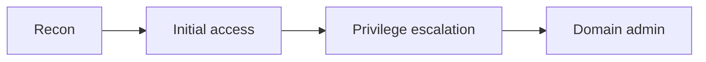

# Welcome

This blog is a static React app. Every article lives in **its own folder**
inside `src/posts/` — the markdown file and its images side by side. Add a new
folder, refresh, and it shows up automatically — no database, no CMS.

## Writing a post

Create a folder named after the post and put the markdown file (same name)
plus any images inside it:

```text
src/posts/
  welcome-to-the-blog/
    welcome-to-the-blog.md
    welcome-cover.png
    diagram.png
```

The folder name becomes the URL — this post is at `/blog/welcome-to-the-blog`.
Every post starts with a small frontmatter block:

```markdown
---
title: My Awesome Write-up
date: 2026-06-11
image: welcome-cover.png
tags: [Web Pentesting, GraphQL]
excerpt: A one-line teaser shown on the blog cards.
---

# Your content starts here
```

The `image:` field sets the **cover photo** — just the file name of an image in
the post's folder (or an absolute `/path` for a shared image, or a full URL).
Leave it out and the card renders without a cover.

## Embedding images

Drop PNG/JPEG images into the post folder, then reference them inline with the
`` tag — with or without the file extension:

```markdown
Here is the request flow:


```

That tag is replaced with the image at build time, so it always points at the
right (hashed) asset. Tags inside code blocks — like the one above — are left
untouched.

## Code blocks are first-class

Fenced code blocks get syntax highlighting and a copy button. Here is some
Python:

```python
import requests

def check(target: str) -> bool:
    r = requests.get(f"https://{target}/.git/config", timeout=5)
    return r.status_code == 200 and "[core]" in r.text

if __name__ == "__main__":
    print(check("example.com"))
```

A bit of Bash:

```bash
# enumerate subdomains and probe live hosts
subfinder -d example.com -silent \
  | httpx -silent -title -status-code \
  | tee live-hosts.txt
```

And some PowerShell, since we are on Windows a lot:

```powershell
Get-ChildItem -Recurse -Filter *.kdbx |
  ForEach-Object { Write-Host "Found vault: $($_.FullName)" }
```

## Callouts

Use GitHub-style callouts for tips, caveats and exploit notes:

> [!NOTE]
> This is a note — handy for context or background.

> [!WARNING]
> Only test systems you are authorised to touch.

> [!EXPLOIT]
> A custom box for highlighting the actual payload or finding.

Supported types: `NOTE`, `TIP`, `IMPORTANT`, `WARNING`, `CAUTION`, `EXPLOIT`.

## Diagrams

Fenced `mermaid` blocks render as diagrams — perfect for attack chains:



## Other markdown features

You also get:

- Tables
- Blockquotes
- Inline `code`
- Links and images

> "The quieter you become, the more you are able to hear." — a fitting reminder
> for anyone doing recon.

| Tool      | Purpose            | Language |
| --------- | ------------------ | -------- |
| nmap      | port scanning      | C        |
| ffuf      | content discovery  | Go       |
| burp      | web proxy          | Java     |

That's it — happy hacking.
